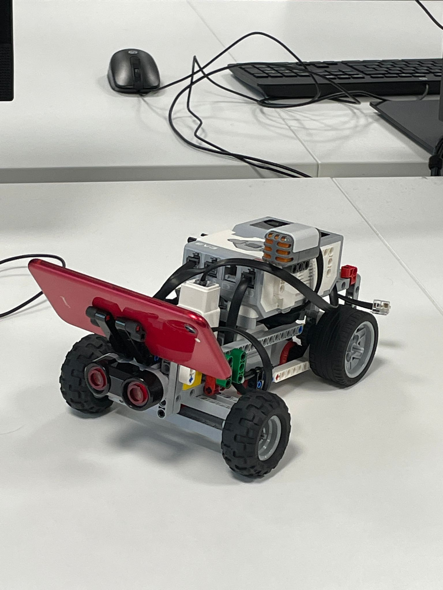

## LaneBot: A Lane Following EV3 robot built with LeJOS and OpenCV 

### Project Description 

LaneBot is an EV3 Robot Built with LeJOS and OpenCV. 

The program consists of the code on the EV3 Brick and the code for the Android App. 

The Android App uses OpenCV to detect a lane using the phone camera
and will send the distance to the edge of the lane over bluetooth to the EV3 brick.

The code on the EV3 Brick will use this information to calculate a steering angle and drive the robot along the lane steering at the correct angle when necessary.

### Files & Descriptions
Files for EV3:

- `LaneBotDriver.java` The Main Driver Class.
- `LaneBotPilot.java` A custom move pilot to control the robots movement.
- `FollowLane.java` A behaviour controlling the robot to follow the lane.
- `ChangeSpeed.java` A behaviour which changes the speed of the robot depending on if a sign of certain colour is detected.
- `DetectSound.java` A behaviour to cause the robot to emergency pull over on detection of specific sound.
- `EmergencyStop.java` A behavior to terminate program on press of Escape button.
- `LowBattery.java` A behaviour to terminate program and send warning when robot is low on battery.
- `Obstructed.java` A behaviour to Stop the robot from moving forward on detection of obstacle.

Files for Android:

- `MainActivity.java` The main activity for the Android app, Initializes OpenCV & Bluetooth, Sends Lane calculation results to EV3.
- `AndroidManifest.xml` The Design & Layout of the app. 

## Extra Info 
The files uploaded for the android app only contain the main folder of the android project. To build the project make sure you add dependencies and libs for latest version of OpenCV. 

The Bluetooth Connection values may be different depending on name and MAC address of the EV3 Brick used. 
### by [Mustaeen Siddiqui](https://github.com/MaskedTTN), [Joel Roy](https://github.com/JoelRoy1), [Wilf Waldron](https://github.com/GitWilf) & [Yonis Abdi](https://github.com/yb700) for CS1821 Java Robotics.

